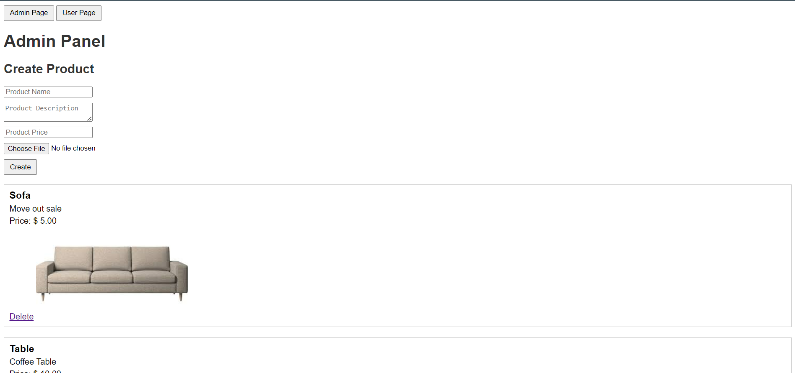
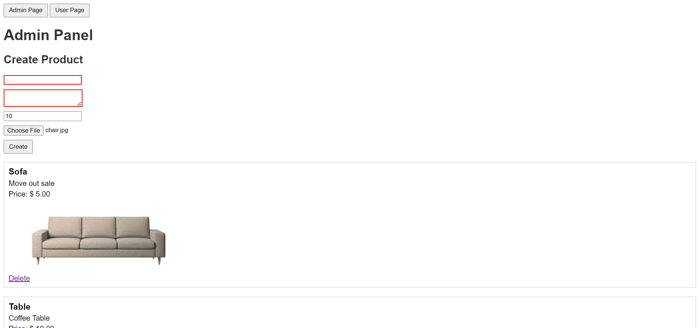
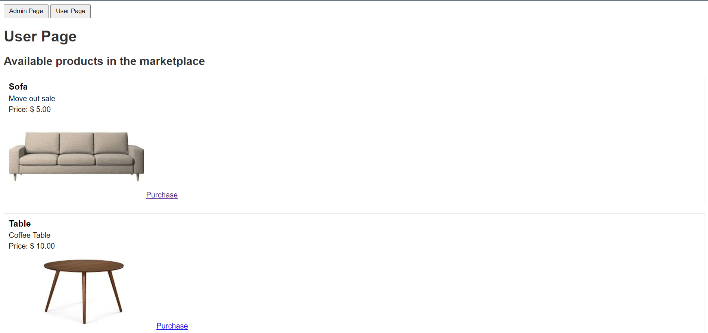

# Marketplace

A website that has the following features:

1. Allows an admin to post a new product or delete an existing product
2. Allows the customer to browse through the available products in the market place
3. Allows the customer to purchase an available product and get it shipped to their address. 

## Instructions to run the application

### Requirements
1. Windows Operating System
2. WAMP Server

### Steps

1. Download WAMP Server on your PC if you don't have one.
        Download Link: `https://www.wampserver.com/en/download-wampserver/`
2. Once downloaded install the WAMP Server and run it. It should show up as a green icon in the taskbar
        
3. By default the Wamp Server folder is created in the root of folder. But if you have installed it someplace else browse to that place. Navigate to the www folder located under wamp folder. For example in my case this was the folder `C:\wamp64\www`
4. Once there open a command prompt or any terminal or an IDE from where you can run the git commands and run the following command 
   `git clone https://github.com/SidhantBansal18/Marketplace.git`
5. After that open any browser and enter the url to start the project from the admin page.
    `http://localhost/marketplace/adminpage.php`

Note: I have written my code in such a way that it will run with default phpmyadmin configurations where you are not required to messup with the database but if you already have a phpmyadmin installed and configured then you can go to config.php file and change the required information like username, password, database name. 
---

### Screenshots

1. Admin Page: 

Only the admin has the priviliges to add or delete a product. It also shows all the products that the admin has put up in the marketplace
 

An error is thrown when an admin tries to enter blank or invalid values

2. User Page: 

User can view all the available products. 

User can purchase a specific product by entering their details

